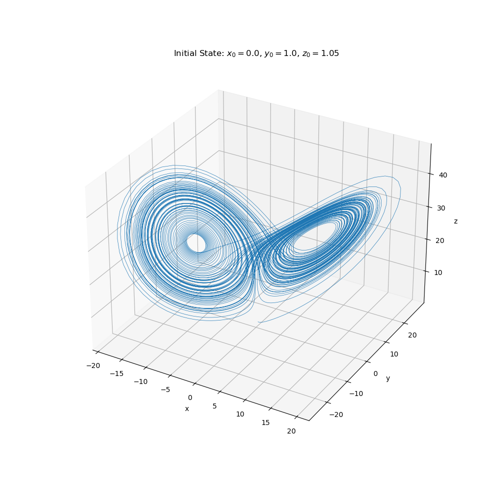

# Runge-Kutta Compute Shader

This project demonstrates GPU-accelerated numerical integration using WebGPU and the Runge-Kutta method. It solves the Lorenz attractor system, a classic example of chaotic dynamics, to showcase how compute shaders can efficiently simulate complex systems.

## Features

- **GPU-Accelerated ODE Solver:** Using the [wgpu](https://wgpu.rs/) portable graphics API, the project offloads the numerical integration of the Lorenz attractor system to the GPU.
- **Runge-Kutta Method:** The project implements the fourth-order Runge-Kutta method to solve the system of ordinary differential equations.
- **Cross-Platform:** The project runs in the browser using WebGPU, enabling GPU acceleration on any platform that supports it.

## Usage

To run this project locally, you need to have [Rust](https://www.rust-lang.org/) installed. Then, you can clone the repository and run the following command:

```sh
cargo run --release
```
This will compile the project and compute the Lorenz attractor trajectory using some initial conditions defined in the main.rs file. You can modify these initial conditions to explore different attractor shapes.

You can find the compute shader code in the `src/shaders.wgsl` file. It file contains the WebGPU Shading Language code that performs the numerical integration on the GPU in the [webgpu shading language](https://www.w3.org/TR/WGSL/). Here you may adjust the Lorenz attractor system or implement your own system of ODEs.

## Example

